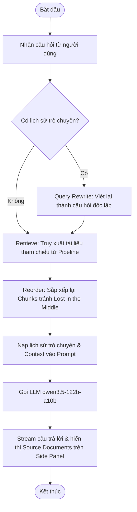

# Bài Tập Nhóm — Search Engine / RAG Chatbot

## Mục Tiêu

Sau khi hoàn thành bài cá nhân, nhóm ngồi lại để xây dựng **1 trong 2 sản phẩm**:

---

## Yêu cầu 1:  Sản phẩm nhóm RAG Chatbot

Xây dựng chatbot trả lời câu hỏi về pháp luật ma tuý và tin tức liên quan.

**Yêu cầu:**
- Giao diện chat (Streamlit / Gradio / Chainlit)
- Trả lời có citation (dựa trên Task 10)
- Hỗ trợ follow-up questions (conversation memory)
- Hiển thị source documents đã dùng

**Stack gợi ý:**
```
Chainlit/Streamlit → Retrieval (Task 9) → Generation (Task 10) → Display
```

---

## Yêu cầu 2: RAG Evaluation Pipeline

Sử dụng **1 trong 3 framework** sau để evaluate pipeline RAG của nhóm:

### Framework lựa chọn

| Framework | Cài đặt | Đặc điểm |
|-----------|---------|-----------|
| [DeepEval](https://github.com/confident-ai/deepeval) | `pip install deepeval` | Nhiều metric built-in, dễ integrate với pytest |
| [RAGAS](https://github.com/explodinggradients/ragas) | `pip install ragas` | Chuẩn industry cho RAG eval, 3 trục chính |
| [TruLens](https://github.com/truera/trulens) | `pip install trulens` | Dashboard UI, feedback functions mạnh |

### Yêu cầu Evaluation

1. **Tạo Golden Dataset** — tối thiểu 15 cặp Q&A (question, expected_answer, expected_context)
2. **Chạy evaluation** trên toàn bộ golden dataset với các metrics sau:
   - **Faithfulness** — câu trả lời có bám đúng context không?
   - **Answer Relevance** — câu trả lời có đúng câu hỏi không?
   - **Context Recall** — retriever có lấy đủ evidence không?
   - **Context Precision** — trong context lấy về, bao nhiêu % thực sự hữu ích?
3. **So sánh A/B** — chạy eval trên ít nhất 2 config khác nhau (ví dụ: có reranking vs không reranking, hoặc hybrid vs dense-only)
4. **Báo cáo** — bảng điểm + phân tích worst performers + đề xuất cải tiến

### Code mẫu — DeepEval

```python
from deepeval import evaluate
from deepeval.metrics import (
    FaithfulnessMetric,
    AnswerRelevancyMetric,
    ContextualRecallMetric,
    ContextualPrecisionMetric,
)
from deepeval.test_case import LLMTestCase

# Tạo test cases từ golden dataset
test_cases = []
for item in golden_dataset:
    result = rag_pipeline.generate_with_citation(item["question"])
    test_case = LLMTestCase(
        input=item["question"],
        actual_output=result["answer"],
        expected_output=item["expected_answer"],
        retrieval_context=[c["content"] for c in result["sources"]],
    )
    test_cases.append(test_case)

# Chạy evaluation
metrics = [
    FaithfulnessMetric(threshold=0.7),
    AnswerRelevancyMetric(threshold=0.7),
    ContextualRecallMetric(threshold=0.7),
    ContextualPrecisionMetric(threshold=0.7),
]

results = evaluate(test_cases, metrics)
```

### Code mẫu — RAGAS

```python
from ragas import evaluate
from ragas.metrics import (
    faithfulness,
    answer_relevancy,
    context_recall,
    context_precision,
)
from datasets import Dataset

# Chuẩn bị data
eval_data = {
    "question": [],
    "answer": [],
    "contexts": [],
    "ground_truth": [],
}

for item in golden_dataset:
    result = rag_pipeline.generate_with_citation(item["question"])
    eval_data["question"].append(item["question"])
    eval_data["answer"].append(result["answer"])
    eval_data["contexts"].append([c["content"] for c in result["sources"]])
    eval_data["ground_truth"].append(item["expected_answer"])

dataset = Dataset.from_dict(eval_data)

# Chạy evaluation
result = evaluate(
    dataset,
    metrics=[faithfulness, answer_relevancy, context_recall, context_precision],
)
print(result.to_pandas())
```

### Code mẫu — TruLens

```python
from trulens.apps.custom import TruCustomApp, instrument
from trulens.core import Feedback
from trulens.providers.openai import OpenAI as TruOpenAI

provider = TruOpenAI()

# Define feedback functions
f_faithfulness = Feedback(provider.groundedness_measure_with_cot_reasons).on_output()
f_relevance = Feedback(provider.relevance).on_input_output()
f_context_relevance = Feedback(provider.context_relevance).on_input()

# Wrap RAG pipeline
tru_rag = TruCustomApp(
    rag_pipeline,
    app_name="DrugLaw_RAG",
    feedbacks=[f_faithfulness, f_relevance, f_context_relevance],
)

# Run evaluation
with tru_rag as recording:
    for item in golden_dataset:
        rag_pipeline.generate_with_citation(item["question"])

# View dashboard
from trulens.dashboard import run_dashboard
run_dashboard()
```

### Deliverable Evaluation

- [ ] File `group_project/evaluation/golden_dataset.json` — 15+ cặp Q&A
- [ ] File `group_project/evaluation/eval_pipeline.py` — script chạy evaluation
- [ ] File `group_project/evaluation/results.md` — bảng điểm + phân tích
- [ ] So sánh A/B ít nhất 2 configs

---

## Yêu Cầu Chung

1. **Tích hợp pipeline** từ bài cá nhân của các thành viên
2. **Demo hoạt động được** trong buổi trình bày (chạy local hoặc deploy)
3. **Evaluation pipeline** chạy được và có báo cáo kết quả
4. **Code push lên repository** chung của nhóm
5. **README** mô tả kiến trúc và phân công (điền bên dưới)

---

## Kiến Trúc Hệ Thống

Hệ thống RAG Chatbot được thiết kế theo luồng xử lý tuần tự (Pipeline Flow) từ lúc nhận yêu cầu đến khi phản hồi cho người dùng:



### Các bước hoạt động chi tiết:
1. **Nhận câu hỏi**: Nhận tin nhắn mới từ giao diện người dùng Chainlit và hiển thị ngay lập tức để giao diện không bị gián đoạn.
2. **Query Rewrite (nếu có lịch sử)**: Tự động chạy cơ chế viết lại câu hỏi tiếp nối dựa trên ngữ cảnh lịch sử trò chuyện của phiên làm việc hiện tại thành một câu hỏi độc lập duy nhất.
3. **Retrieve (Truy xuất tài liệu)**: Truy xuất các tài liệu pháp luật và tin tức liên quan từ cơ sở dữ liệu (sử dụng hybrid search kết hợp dense & sparse search, reranking và pageindex fallback).
4. **Reorder (Sắp xếp tránh Lost in the Middle)**: Sắp xếp lại danh sách tài liệu tìm kiếm được (đặt các tài liệu có độ tương đồng cao nhất ở đầu và cuối prompt, tài liệu ít tương đồng ở giữa) để tối ưu hóa sự tập trung của LLM.
5. **Nạp lịch sử nói chuyện**: Gộp toàn bộ lịch sử trò chuyện và ngữ cảnh tài liệu tham chiếu đã tối ưu vào prompt cấu trúc.
6. **Gọi LLM & Stream trả lời**: Gọi mô hình `qwen3.5-122b-a10b` thông qua `AsyncOpenAI` ở chế độ stream để trả lời người dùng trong thời gian thực kèm trích dẫn (citation), đồng thời hiển thị văn bản tham chiếu gốc ở cột Side Panel.

---

## Phân Công Công Việc

| Thành viên | MSSV | Nhiệm vụ | Trạng thái |
|-----------|------|----------|------------|
| Nguyễn Tiến Huân | 2A202600855 | - Thu thập, làm sạch & convert dữ liệu (Task 1-3)<br>- Thiết kế Chunking & Indexing Weaviate (Task 4)<br>- Triển khai Semantic Search & BM25 (Task 5-6)<br>- Reranking (RRF, MMR, Cross-Encoder) & PageIndex (Task 7-8)<br>- Tích hợp Pipeline & Generation (Task 9-10)<br>- Xây dựng UI Chatbot, Query Rewriting & Streaming (app.py) | Hoàn thành |

---

## Hướng Dẫn Chạy

```bash
# Cài đặt dependencies
pip install -r requirements.txt

# Chạy app
streamlit run app.py
# hoặc
chainlit run app.py
```

---

## Lưu ý: Hãy giữ lại repo này nếu như bạn học track 3 giai đoạn 2, chúng ta sẽ phát triển tiếp dự án lên knowledge graph để khắc phục các câu hỏi hóc búa khi có các câu hỏi khó.
